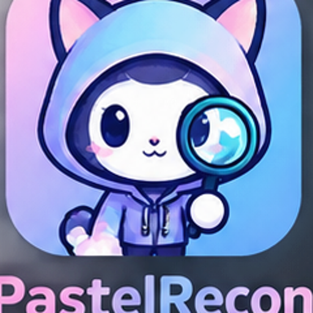

<div align="center">
  

# PastelRecon

**Find real CVE PoC references. Filter the noise.**

A lightweight defensive research tool that verifies a CVE through NVD, searches public GitHub repositories, evaluates trust signals, removes duplicates, and ranks likely proof-of-concept references without downloading or executing them.


</div>

---

## Why PastelRecon?

Searching a CVE on the web often returns copied advisories, SEO spam, empty repositories, forks, misleading "exploit" pages, and occasionally suspicious code. PastelRecon narrows that search by combining authoritative CVE data with repository metadata and transparent scoring signals.

It is designed to help a researcher answer a narrower question:

> **Which public references are worth reviewing manually first?**

PastelRecon does **not** claim that a high-scoring repository is safe, genuine, or appropriate to execute.

## Features

- Validates CVE identifiers before searching.
- Confirms the CVE through the NVD API.
- Extracts references from a conservative source allowlist.
- Searches GitHub for repositories mentioning the exact CVE.
- Reads repository metadata and README text through the GitHub API.
- Checks whether the repository contains likely source/reproduction files.
- Scores candidates using explainable positive and negative signals.
- Flags suspicious terminology.
- Removes duplicate results.
- Shows how many items were searched, rejected, deduplicated, and accepted.
- Supports JSON output for later analysis.
- Never clones or executes discovered PoCs.

## Installation

### 1. Clone the repository

```bash
git clone https://github.com/YOUR_USERNAME/PastelRecon.git
cd PastelRecon
```

### 2. Create a virtual environment

Linux/macOS:

```bash
python3 -m venv .venv
source .venv/bin/activate
```

Windows PowerShell:

```powershell
py -m venv .venv
.\.venv\Scripts\Activate.ps1
```

### 3. Install dependencies

```bash
python3 -m pip install -r requirements.txt
```

## Usage

Run the script directly:

```bash
python3 pastelrecon.py -o CVE-2024-3400
```

Raise the confidence threshold:

```bash
python3 pastelrecon.py -o CVE-2024-3400 --minimum-score 60
```

Inspect more GitHub results:

```bash
python3 pastelrecon.py -o CVE-2024-3400 --maximum-results 50
```

Save the complete output to JSON:

```bash
python3 pastelrecon.py -o CVE-2024-3400 --minimum-score 60 --json results.json
```

## Example search summary

```text
================ Search Summary ================
CVE                 : CVE-2024-3400
NVD References      : 5
GitHub Repositories : 20
Candidates Examined : 25
Duplicates Removed  : 3
Rejected (<60)      : 15
Final Results       : 7
================================================
```

The counts make the filtering process visible instead of presenting only the final links.

## Optional API keys

PastelRecon works without API keys, but unauthenticated APIs have lower rate limits.

### GitHub

Create a GitHub token appropriate for public-repository API access and expose it as an environment variable:

Linux/macOS:

```bash
export GITHUB_TOKEN="your_token_here"
```

Windows PowerShell:

```powershell
$env:GITHUB_TOKEN="your_token_here"
```

### NVD

```bash
export NVD_API_KEY="your_nvd_api_key"
```

Never commit API keys to the repository. `.env` is ignored by the included `.gitignore`.

## How scoring works

PastelRecon uses a heuristic score from `0` to `100`. Signals currently include:

| Signal | Effect |
|---|---:|
| Exact CVE in repository name | Positive |
| Exact CVE in repository description | Positive |
| Exact CVE in README | Positive |
| PoC/reproducer terminology | Positive |
| Recognized source/reproduction files | Positive |
| Known security-research owner | Positive |
| Stars/forks and repository age | Small positive |
| CVE absent from README | Negative |
| No recognizable source files | Negative |
| Very new, empty, archived, or forked repository | Negative |
| Suspicious terminology | Strong negative |

Confidence labels are currently:

| Score | Label |
|---:|---|
| 80-100 | High |
| 60-79 | Moderate |
| 40-59 | Low |
| 0-39 | Untrusted |

These values are prioritization signals, **not malware analysis**.

## Trusted sources

PastelRecon starts with NVD and uses a conservative allowlist for NVD-linked references, including sources such as GitHub, GitLab, Exploit-DB, Packet Storm, Project Zero, GitHub Security Lab, Talos, ZDI, Rapid7, and Metasploit-related resources.

The allowlist is intentionally conservative. A legitimate PoC hosted somewhere else may therefore be omitted.

## Project structure

```text
PastelRecon/
├── assets/
│   ├── icon.png
├── .gitignore
├── LICENSE
├── README.md
├── pastelrecon.py
└── requirements.txt
```

## Security model and limitations

PastelRecon only identifies and ranks references. It intentionally does not clone repositories, download exploit files, compile code, or execute PoCs.

A malicious repository can still appear legitimate. Stars can be manipulated, repository descriptions can lie, and harmful code can avoid suspicious keywords. Always inspect third-party code manually and use an isolated, authorized environment for vulnerability research.

## Responsible use

Use PastelRecon only for lawful, authorized security research. You are responsible for ensuring that your testing complies with the rules and authorization applicable to the systems you assess.

## Contributing

Contributions, bug reports, and suggestions are welcome. Feel free to open an issue or submit a pull request.

## License

PastelRecon is released under the [MIT License](LICENSE).

---

<div align="center">
  <strong>PastelRecon</strong> — less noise, better signals.
</div>
